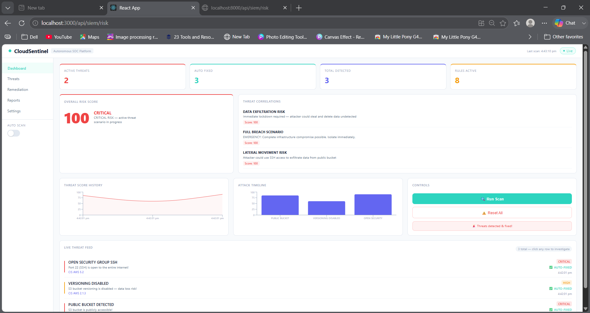

Perfect! Here's your complete README — create a file called `README.md` in your root project folder and paste this:

```markdown
# 🛡️ CloudSentinel — Autonomous Cloud Security Operations Platform

> Built by **Sanjana Chinta** | B.E Computer Science (Cybersecurity) | 3rd Year

CloudSentinel is a fully autonomous, AI-powered Security Operations Center (SOC) that detects, analyzes, and auto-remediates cloud security threats in real time — all running locally with zero cloud costs.

---

## 🎬 Demo

> *Run a scan → Watch threats get detected → AI analyzes each one → System auto-fixes everything in seconds*



---

## 🧠 How It Works

```
[ THREAT DETECTOR ]     [ AI ANALYST ]          [ SIEM ENGINE ]        [ AUTO-REMEDIATION ]
 Python + Boto3    ──►  Llama 3 + RAG      ──►  Correlation +     ──►  Boto3 + Slack Alert
 Scans LocalStack       ChromaDB + CIS PDF       Risk Scoring           Locks down threat
 every 10 seconds       Analyzes threat          Finds patterns         instantly
```

1. **Detector** continuously scans fake AWS infrastructure (LocalStack) for misconfigurations
2. **AI Analyst** queries a CIS AWS Benchmark PDF via RAG and analyzes each threat using a local LLM
3. **SIEM Engine** correlates threats, scores overall risk, and identifies attack scenarios
4. **Remediation** automatically fixes each vulnerability and sends a formatted Slack alert

---

## ⚡ Features

### Multi-Threat Detection
| Threat | Severity | CIS Rule | Auto-Fix |
|--------|----------|----------|----------|
| Public S3 Bucket | CRITICAL | CIS AWS 2.1.5 | ✅ Sets ACL to private |
| Versioning Disabled | HIGH | CIS AWS 2.1.3 | ✅ Enables versioning |
| Open SSH Port (0.0.0.0/0) | CRITICAL | CIS AWS 5.2 | ✅ Revokes ingress rule |

### RAG-Powered AI Analysis
- Embeds the official **CIS AWS Foundations Benchmark PDF** into ChromaDB
- Uses **Llama 3 (via Ollama)** running 100% locally — no API keys, no cost
- Each threat gets a detailed AI explanation and recommended action

### SIEM Correlation Engine
Identifies complex attack scenarios by correlating individual threats:
- **DATA_EXFILTRATION_RISK** — Public bucket + versioning disabled
- **LATERAL_MOVEMENT_RISK** — Public bucket + open SSH port
- **FULL_BREACH_SCENARIO** — All three misconfigurations active simultaneously

### Real-Time Dashboard
- Live threat feed with click-to-investigate panels
- Real-time in-app notifications via Server-Sent Events
- Attack timeline visualization
- Overall risk score (0-100) with severity classification
- Auto-scan toggle (scans every 15 seconds automatically)

### Slack Alerts
Formatted alerts sent to Slack the moment a threat is detected and fixed — including threat type, severity, CIS rule violated, and remediation status.

---

## Tech Stack

| Layer | Technology |
|-------|-----------|
| Cloud Simulation | LocalStack (fake AWS) |
| Infrastructure as Code | Terraform |
| Backend API | FastAPI (Python) |
| Frontend | React |
| AI Model | Llama 3 via Ollama (runs locally) |
| Vector Database | ChromaDB |
| AI Framework | LangChain |
| Embeddings | sentence-transformers (all-MiniLM-L6-v2) |
| Security Rulebook | CIS AWS Foundations Benchmark |
| Cloud SDK | Boto3 |
| Alerts | Slack Webhooks |
| Containerization | Docker |

---

## Getting Started

### Prerequisites
- Python 3.11+
- Node.js 18+
- Docker Desktop
- Terraform
- Ollama

### Installation

**1. Clone the repo**
```bash
git clone https://github.com/sanjanachintaa/autonomous-cloud-soc
cd autonomous-cloud-soc
```

**2. Install Python dependencies**
```bash
pip install -r requirements.txt
```

**3. Install frontend dependencies**
```bash
cd frontend
npm install
cd ..
```

**4. Set up environment variables**
```bash
# Create a .env file in the root folder
SLACK_WEBHOOK=your-slack-webhook-url
LOCALSTACK_AUTH_TOKEN=your-localstack-token
```

**5. Download the AI model**
```bash
ollama pull tinyllama
```

**6. Download the CIS AWS Benchmark PDF**

Download from [cisecurity.org](https://www.cisecurity.org/benchmark/amazon_web_services) and save as `ai_agent/security_rules.pdf`

### Running the Project

Open 4 terminals and run these in order:

**Terminal 1 — Start LocalStack:**
```bash
docker run --rm -it -p 4566:4566 -e LOCALSTACK_AUTH_TOKEN=your-token localstack/localstack
```

**Terminal 2 — Deploy infrastructure:**
```bash
cd infrastructure
terraform init
terraform apply
```

**Terminal 3 — Start API:**
```bash
uvicorn api:app --reload
```

**Terminal 4 — Start Dashboard:**
```bash
cd frontend
npm start
```

Visit **http://localhost:3000** 🎉

---

## Project Structure

```
autonomous-cloud-soc/
├── api.py                  # FastAPI backend — all API routes
├── siem.py                 # SIEM engine — correlation, scoring, timeline
├── main.py                 # Standalone pipeline runner
├── infrastructure/
│   └── main.tf             # Terraform — deploys vulnerable AWS resources
├── ai_agent/
│   ├── ai_analyst.py       # RAG system — embeds CIS PDF into ChromaDB
│   └── security_rules.pdf  # CIS AWS Benchmark (download separately)
├── logs/
│   └── log_watcher.py      # Standalone log monitoring script
├── remediation/
│   └── remediation.py      # Standalone remediation script
├── frontend/
│   └── src/
│       └── components/
│           └── Dashboard.jsx  # React dashboard
├── docker-compose.yml      # One-command setup (in progress)
├── Dockerfile.api          # API container
├── requirements.txt        # Python dependencies
└── .env                    # Secrets (not committed)
```

---

## Future Improvements

- [ ] Deploy dashboard to Vercel + API to Railway
- [ ] Swap LocalStack for real AWS free tier
- [ ] Add more threat types (S3 logging disabled, MFA delete not enabled)
- [ ] ML-based anomaly detection for unusual API call patterns
- [ ] Full Docker Compose one-command setup
- [ ] Threat hunting queries

---

## Key Concepts Demonstrated

- **Infrastructure as Code (IaC)** — Terraform scripts define cloud resources
- **RAG (Retrieval-Augmented Generation)** — AI queries a real security rulebook
- **SIEM Correlation** — Multiple threats combined into attack scenarios
- **Closed-Loop Automation** — Detect → Analyze → Fix with zero human intervention
- **Event-Driven Architecture** — Real-time threat streaming via Server-Sent Events
- **SecOps Automation** — Incident response triggered automatically

---

## Contact

**Sanjana Chinta**  
B.E Computer Science (Cybersecurity) — 3rd Year  
[GitHub](https://github.com/sanjanachintaa)

---

*Built entirely locally — no cloud costs, no API keys, 100% free.*
